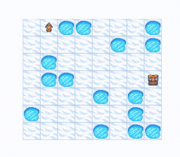

# MOUSE Core 🧠

<p align="center"></p>

> **Warning:** MOUSE is in early development and is not yet ready for production use. APIs may change without notice.

**mouse-core** is the core library for the Meta-Optimization Using Sequential Experience (MOUSE) learning system — a modular PyTorch stack for <u>in-context reinforcement learning (ICRL)</u>. It provides data utilities, embedding frameworks, transformer backbones, output heads, and objective functions for training and deploying agents that adapt from transition history at inference time, **without weight updates**.

**[mouse-gym](https://github.com/micahr234/mouse-gym)** sits alongside mouse-core and handles the environment side: it wraps any Gymnasium env into a reset-free continuing interface, stitching episodes together into uninterrupted trajectories with explicit task boundaries. Environment implementations live in their own packages — the examples use **[procedural-frozenlake](https://github.com/micahr234/procedural-frozenlake)**, a FrozenLake variant with procedurally generated maps and optimal-Q supervision signals. **mouse-core** is what you use to learn from those trajectories — data utilities, models, and objectives for training and deploying in-context RL agents.


## News 📰

- **2026-06-26 — Offline training works.** [`examples/02_train_offline.ipynb`](examples/02_train_offline.ipynb) now trains a full `Qwen/Qwen3-0.6B` MOUSE model from Hub replay data and reaches strong FrozenLake performance. Push the checkpoint, then evaluate in [`examples/04_inference.ipynb`](examples/04_inference.ipynb).

See [CHANGELOG.md](CHANGELOG.md) for the full release history.


## Why MOUSE exists 💡

MOUSE is built around two observations:

1. General learning systems that scale tend to outperform hand-crafted solutions in the long run. This idea is captured in Rich Sutton's essay [The Bitter Lesson](https://web.archive.org/web/20260409023855/https://www.incompleteideas.net/IncIdeas/BitterLesson.html). MOUSE takes that lesson seriously: it meta-learns during training how to solve tasks, so that at deployment time it can adapt to new situations from experience.

2. Learning must not stop at deployment time. The [Big World Hypothesis](http://incompleteideas.net/papers/The_Big_World_Hypothesis.pdf) says that real environments are too vast to model completely ahead of time, so agents cannot be given all the information they will need before they act. MOUSE adapts by conditioning on prior history rather than updating its weights. Because the weights remain fixed at deployment, this avoids plasticity loss, a common continual-learning failure mode where repeated updates gradually reduce an agent's ability to learn.

In the video below, an agent plays FrozenLake on a map it has never seen before, with the map hidden from the agent. Without gradient updates, using only in-context learning, it tries different paths until it finds one that leads directly to the goal. You can train one yourself using the [example notebooks](examples/).

<p align="center"></p>


## Install 📦

```bash
pip install mouse-core
```

For development:

```bash
git clone https://github.com/micahr234/mouse-core.git
cd mouse-core
source scripts/install.sh
```


## Core components 🧩

mouse-core gives you three building blocks for in-context RL. Compose them in your own training loop:

* **Data** (`mouse_core.data`) — stores sequential rows in `Datastore` and batches contiguous windows with `DataLoader`.
* **Models** (`mouse_core.models`) — encoder + backbone (`LlamaBackbone`, `Qwen3Backbone`, or `IdentityBackbone`) + output heads (`DiscreteActionHead`, `DiscreteActionValueHead`, …).
* **Objectives** (`mouse_core.objectives`) — training losses such as DQN, VecDQN, PPO, GRPO, SP, and SV.

Backbone loading has one public path: instantiate the backbone. For example, `LlamaBackbone(pretrained="meta-llama/Llama-3.2-1B", num_layers=2)` reads the pretrained config, loads matching transformer weights, and exposes `backbone.hidden_dim` for the encoder and heads.


## Quick start 🚀

The [example notebooks](examples/) are the primary documentation. Work through them in order:

| Notebook | What it covers |
|----------|----------------|
| [01 — Collect dataset](examples/01_collect_dataset.ipynb) | `Datastore`, collecting transitions, pushing to the Hub |
| [02 — Train offline](examples/02_train_offline.ipynb) | Offline replay baseline, model architecture, DQN training *(recommended first training run)* |
| [03 — Train online](examples/03_train_online.ipynb) | Live `mouse-gym` rollouts, in-memory replay, DQN updates |
| [04 — Inference](examples/04_inference.ipynb) | Batched FlexAttention cached inference, loading the current checkpoint from the shared Hub model repo |
| [05 — Layerwise DQN offline](examples/05_train_offline_layerwise_dqn.ipynb) | Same offline loop as `02`, with per-layer Q heads and `LayerwiseDqnObjective` |
| [06 — Vector-DQN offline](examples/06_train_offline_vec_dqn.ipynb) | Same offline loop as `02`, with 2D action vectors and `VecDqnObjective` |
| [07 — TextEmbedder offline](examples/07_train_offline_text.ipynb) | Same offline loop as `02`, with `TextEmbedder` (`token` + `text`; `image` documented for VL checkpoints) |
| [08 — Train online PPO](examples/08_train_online_ppo.ipynb) | Online on-policy PPO (`DiscreteActionHead` + value head, `PpoObjective` with GAE) |
| [09 — Train online GRPO](examples/09_train_online_grpo.ipynb) | Branched GRPO: fork env+context at many `L`, group-relative advantages, `GrpoObjective` |

Each notebook explains the relevant concepts inline. API details live in the Python docstrings (`load_model`, `Datastore`, `DqnObjective`, etc.).


## Contributing 🔧

See [CONTRIBUTING.md](CONTRIBUTING.md).


## License 🔑

GNU General Public License v3.0 — see [LICENSE](LICENSE).
