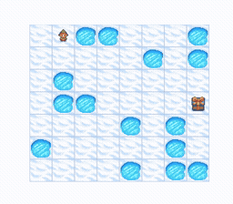

# MOUSE Core 🧠

<p align="center"></p>

> **Warning:** MOUSE is in early development and is not yet ready for production use. APIs may change without notice.

**mouse-core** is the core library for the Meta-Optimization Using Sequential Experience (MOUSE) learning system — a modular PyTorch stack for <u>in-context reinforcement learning (ICRL)</u>. It provides data utilities, embedding frameworks, transformer backbones, output heads, and objective functions for training and deploying agents that adapt from transition history at inference time, **without weight updates**.

**[mouse-gym](https://github.com/micahr234/mouse-gym)** sits alongside mouse-core and handles the environment side: it wraps any Gymnasium env into a **reset-free** continuing interface. Episodes still end as usual, but you choose how many episodes make up a **task** (`episodes_per_task`), so the hard division is at task boundaries rather than after every episode. Each step reports that with two `0`/`1`/`2` fields: `episode_done` (Gymnasium terminated/truncated) and `task_done` (task budget exhausted). Environment implementations live in their own packages — the examples use **[procedural-frozenlake](https://github.com/micahr234/procedural-frozenlake)**, a FrozenLake variant with procedurally generated maps and optimal-Q supervision signals. **mouse-core** is what you use to learn from those trajectories — data utilities, models, and objectives for training and deploying in-context RL agents.


## News 📰

- **2026-08-18 — mouse-gym 1.0.0.** The env step contract is now `episode_done` / `task_done` (each `0`/`1`/`2`) instead of a single 5-code `done` field. `EnvConfig.seed` advances once per task and is passed to `reset(seed=...)` only at task start. The `examples` extra installs `mouse-gym` from GitHub `main`.
- **2026-06-26 — Offline training works.** [`examples/02_train_offline_dqn.ipynb`](examples/02_train_offline_dqn.ipynb) now trains a full `Qwen/Qwen3-0.6B` MOUSE model from Hub replay data and reaches strong FrozenLake performance. Push the checkpoint, then evaluate in [`examples/09_inference.ipynb`](examples/09_inference.ipynb).

See [CHANGELOG.md](CHANGELOG.md) for the full release history.


## Why MOUSE exists 💡

MOUSE is built around two observations:

1. General learning systems that scale tend to outperform hand-crafted solutions in the long run. This idea is captured in Rich Sutton's essay [The Bitter Lesson](https://web.archive.org/web/20260409023855/https://www.incompleteideas.net/IncIdeas/BitterLesson.html). MOUSE takes that lesson seriously: it meta-learns during training how to solve tasks, so that at deployment time it can adapt to new situations from experience.

2. Learning must not stop at deployment time. The [Big World Hypothesis](http://incompleteideas.net/papers/The_Big_World_Hypothesis.pdf) says that real environments are too vast to model completely ahead of time, so agents cannot be given all the information they will need before they act. MOUSE adapts by conditioning on prior history rather than updating its weights. Because the weights remain fixed at deployment, this avoids plasticity loss, a common continual-learning failure mode where repeated updates gradually reduce an agent's ability to learn.

In the video below, an agent plays FrozenLake on a map it has never seen before, with the map hidden from the agent. Without gradient updates, using only in-context learning, it tries different paths until it finds one that leads directly to the goal. You can train one yourself using the [example notebooks](examples/).

<p align="center"></p>


## Install 📦

```bash
pip install mouse-core
```

For development (free-threaded Python **3.14t** via uv — required for
`DataLoader(num_workers>0)`):

```bash
git clone https://github.com/micahr234/mouse-core.git
cd mouse-core
source scripts/install.sh
```


## Core components 🧩

mouse-core gives you three building blocks for in-context RL. Compose them in your own training loop:

* **Data** (`mouse_core.data`) — stores sequential rows in `Datastore` and batches contiguous windows with `DataLoader`.
* **Models** (`mouse_core.models`) — encoder + backbone (`LlamaBackbone`, `Qwen3Backbone`, or `IdentityBackbone`) + output heads (`DiscreteActionHead`, `DiscreteActionValueHead`, …).
* **Objectives** (`mouse_core.objectives`) — training losses such as DQN, episode/task DQN, PPO, GRPO, SP, and SV.

Backbone loading has one public path: instantiate the backbone. For example, `LlamaBackbone(train_kernel="flex", decode_kernel="flex", dtype=preferred_dtype(device), pretrained="meta-llama/Llama-3.2-1B", num_layers=2)` reads the pretrained config, loads matching transformer weights, and exposes `backbone.hidden_dim` for the encoder and heads. Three arguments are required on every transformer backbone (and on `load_model`) because they describe how the model runs on your machine, not what it is, so they are never saved with it: `train_kernel` for the uncached forward, `decode_kernel` for cached decode (`"flex"`, paged FlexAttention, the only kernel that reads K/V through a page table), and `dtype` for the base weights. `model.to(device)` moves and never casts; every part other than the backbone base is float32.

Training runs the transformer over the flat packed token stream (`packed_forward` in `mouse_core.models.backbone`): tokens are regrouped by `(sequence, grouping id)` and attention is causal within each group. `train_kernel` picks the kernel over those groups, so they can be compared on the same weights and streams: `"varlen"` is PyTorch's FlashAttention varlen kernel on CUDA with a bf16/fp16 base (the LoRA setup) and the same decoder body with masked SDPA on CPU or with an fp32 base; `"padded"` right-pads each group to `max_seqlen` and runs dense causal SDPA on the rectangular `[n_seg, H, S, Dh]` tensor (Flash when every group is already that long); `"flex"` is FlexAttention with a block-sparse mask over the groups, compiled on CUDA in every dtype (forward-only on CPU, where FlexAttention has no backward), which makes it the kernel for full fp32 fine-tuning. Call `install_compiled_decoder()` before training to `torch.compile` the per-layer train decoder body once (idempotent, a few seconds of warmup, used by every layer and stream length); on CUDA that call also compiles the cached-decode layer. Set `backbone.gradient_checkpointing = True` to recompute layers in backward: roughly a 10x cut in activation memory for about 1.4x the step time. `bench/bench_train.py` measures the packed train path on your GPU; `bench/bench_inference.py` times paged FlexAttention prefill and one-token decode. `bench/bench_dataloader.py` times `DataLoader.next_batch`. Env step rate is `bench/bench_env.py` in [mouse-gym](https://github.com/micahr234/mouse-gym).

Rollout and inference decode incrementally with `model(batch, cache=out.cache, use_cache=True)`: on every call each sequence may add any number of steps, including zero. The `DecodeCache` holds one `FlexDecodeSession` per backbone pass, whose KV cache is a paged pool shared by the whole batch: each sequence owns as many 128-token pages as its own history needs, so a batch with one long stream and many short ones costs the sum of their lengths rather than `batch × longest`, and `cache.reset_rows(rows)` hands a finished stream's pages back to the pool. Attention runs through FlexAttention over only the pages a row owns, compiled on CUDA in every dtype, so each row's decode cost tracks its own history rather than the batch maximum. The per-layer decode body is compiled in two pieces (pre: QKV + KV scatter; post: o-proj + MLP) like the train body; FlexAttention stays its own compiled kernel so the scatter is visible. After warmup the common one-token-per-row step is CUDA-graphed. Page growth, mask build, and address setup stay eager so a growing cache does not recompile. fp32 decode is as fast as bf16 once `torch.set_float32_matmul_precision("high")` (TF32: fp32 storage and accumulation, 10-bit-mantissa matmul inputs) is set; without it a long fp32 row is compute-bound at up to 2.5x the bf16 step time.

The delayed DQN model is `model.delayed_copy()`: a frozen copy of the online model in which every trainable parameter is copied and every frozen parameter (the bf16 LoRA base) is shared by reference. It runs on the same `TokenBatch` as the online model, and `Polyak(model, delayed_model).update(tau_heads=..., tau_encoder=..., tau_backbone=...)` interpolates each section in fp32 with its own τ after every optimizer step (`0` frozen, `1` copy of the online weights). `ExponentialDecay` and `Piecewise` (`from mouse_core import ExponentialDecay, Piecewise`) schedule such scalars over optimizer steps.


## Quick start 🚀

The [example notebooks](examples/) are short usage docs, not full experiments. Work through them in order, then evaluate a saved checkpoint in `09`. Full training runs live in **[mouse-experiment](https://github.com/micahr234/mouse-experiment)**.

| Notebook | What it covers |
|----------|----------------|
| [01 — Collect dataset](examples/01_collect_dataset.ipynb) | `Datastore`, collecting transitions, pushing to the Hub |
| [02 — Train offline DQN](examples/02_train_offline_dqn.ipynb) | Offline replay baseline, model architecture, DQN training |
| [03 — Train online DQN](examples/03_train_online_dqn.ipynb) | Live `mouse-gym` rollouts, in-memory replay, DQN updates |
| [04 — Layerwise DQN offline](examples/04_train_offline_layerwise_dqn.ipynb) | Same offline loop as `02`, with per-layer Q heads and `LayerwiseDqnObjective` |
| [05 — Train offline SV](examples/05_train_offline_sv.ipynb) | Same offline loop as `02`, regressing the action-value head onto `info_q_star` with `SvObjective` |
| [06 — TextTokenizer offline DQN](examples/06_train_offline_text_dqn.ipynb) | Same offline loop as `02`, with `TextTokenizer` + `TextEmbedder` and a trailing learnable `value` token (`text` / `token` / `image` / `learnable`) |
| [07 — Train online PPO](examples/07_train_online_ppo.ipynb) | Online on-policy PPO (`DiscreteActionHead` + value head, `PpoObjective` with GAE) |
| [08 — Train online GRPO](examples/08_train_online_grpo.ipynb) | Branched GRPO: fork env+context at many `L`, group-relative advantages, `GrpoObjective` |
| [09 — Inference](examples/09_inference.ipynb) | Evaluation: load a Hub checkpoint and run batched FlexAttention cached inference (`max_cache` / `start_cache`) |
| [10 — Train offline SP](examples/10_train_offline_sp.ipynb) | Same offline loop as `05`, but `SpObjective` CE onto a random argmax of `info_q_star` with `DiscreteActionHead` *(ranking check)* |
| [11 — Offline reasoning DQN](examples/11_train_offline_reasoning_dqn.ipynb) | Same offline loop as `02` (including the trailing learnable `value` prompt), plus Coconut-style latent reasoning bursts (`LatentReasoner`, `sample_reasoning_splits`) trained through the DQN loss |
| [12 — Offline recurrent DQN](examples/12_train_offline_recurrent_dqn.ipynb) | Same offline loop as `02`, with a `Recurrence` section: the backbone runs `num_passes` times per forward through a normalized input-injection adapter, `DqnObjective` runs on every pass in `out.passes` and the losses are averaged; cached inference keeps the same passes |
| [13 — Offline episode/task DQN](examples/13_train_offline_episode_task_dqn.ipynb) | Same offline loop as `02`, with `action_value_episode` + `action_value_task` heads and `EpisodeTaskDqnObjective`: both heads share one delayed `a* = argmax(Q_e + Q_t)`; `get_action` maximizes the sum |

### Example dependencies

The notebooks need the `examples` extra (`mouse-gym`, `procedural-frozenlake`, `matplotlib`, …). A full `source scripts/install.sh` already installs it via `mouse-core[all]`. From a lighter venv:

```bash
uv pip install -e ".[examples]" --python .venv/bin/python
```

That pulls `gymnasium[toy-text]` → `pygame-ce`. On free-threaded Python there is often no prebuilt `pygame-ce` wheel, so the install builds from source and needs SDL2 / PortMidi headers. On Debian/Ubuntu:

```bash
sudo apt install libsdl2-dev libsdl2-image-dev libsdl2-mixer-dev libsdl2-ttf-dev libportmidi-dev libfreetype6-dev
```

Without these, install fails with errors like `library 'SDL2' not found` or `library 'portmidi' not found`.

Each notebook explains the relevant concepts inline. API details live in the Python docstrings (`load_model`, `Datastore`, `DqnObjective`, etc.).

Every trainable parameter is float32, so plain `AdamW(...)` steps it in place and `Polyak` interpolates in fp32 — no master weights or shadows. Two ways to train the backbone:

- **Full fp32 fine-tuning** — `Qwen3Backbone(train_kernel="flex", decode_kernel="flex", dtype=torch.float32, pretrained="Qwen/Qwen3-0.6B")`; the whole model is float32. Use `"flex"` here: it is compiled and block-sparse in fp32, whereas `"varlen"` on an fp32 base falls to the masked-SDPA reference (the flash kernel needs bf16/fp16) and warns.
- **fp32 LoRA on a frozen bf16 base** — `Qwen3Backbone(train_kernel="flex", decode_kernel="flex", dtype=preferred_dtype(device), pretrained="Qwen/Qwen3-0.6B", lora=LoRAConfig(rank=16, alpha=32))`: on CUDA the frozen base is **bfloat16** and runs FlexAttention, while the LoRA adapters, encoder, reasoner / recurrence, and heads are float32.

Then `model.to(device)`. `AdamW` and `Polyak` reject a trainable non-fp32 parameter, so a fully trainable backbone built in bf16 fails loudly at training time. For inference either kind of checkpoint can be loaded with `dtype=preferred_dtype(device)`.


## Contributing 🔧

See [CONTRIBUTING.md](CONTRIBUTING.md).


## License 🔑

GNU General Public License v3.0 — see [LICENSE](LICENSE).
